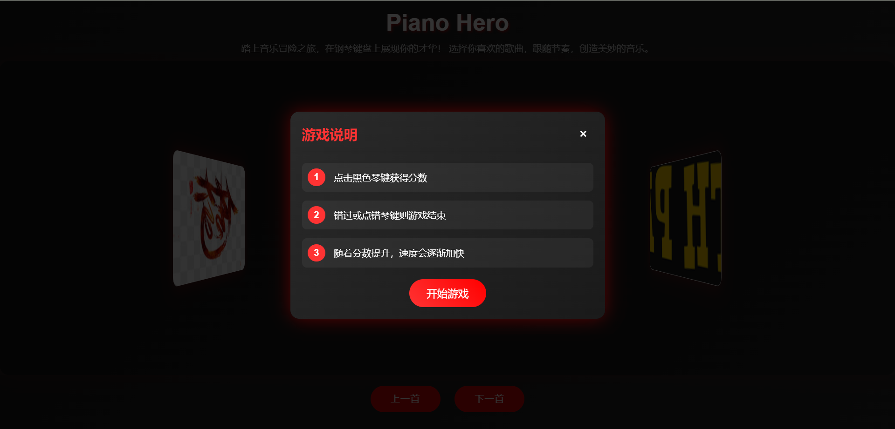

# 🎹 钢琴英雄：节奏与音乐的完美邂逅

## ✨ 特色亮点

🎵 经典歌曲改编，从流行到古典应有尽有  
🎮 简单上手，考验反应的音乐节奏游戏  
🏆 独特成就系统，解锁音乐大师称号  
🎨 优雅的视觉设计，沉浸式游戏体验  
🔥 难度递进，越玩越有挑战性

## 🎯 游戏预览

<div align="center">
    
    <p>精美的3D轮播菜单，展示多样化的曲目选择</p>
</div>

<div align="center">
    
    <p>清晰的游戏规则说明，帮助新手快速上手</p>
</div>

<div align="center">
    
    <p>简洁的游戏界面，沉浸式的音乐节奏体验</p>
</div>


## 🎯 游戏玩法

像弹钢琴一样，点击下落的黑键即可得分！随着分数提升，速度会逐渐加快，考验你的反应能力。错过或点错琴键就会游戏结束，看看你能达到多少分！

### 操作说明
- 🖱️ 点击黑色琴键得分
- ⌨️ 避免点击白色琴键
- 🎯 不要让黑键落到底部
- 🏃‍♂️ 速度会随分数提升而加快

## 🎵 曲目列表

- 🎼 South Park Theme
- 🎼 The Simpsons Theme
- 🎼 传奇
- 🎼 盗将行

## 💡 开发灵感

将经典的钢琴块玩法与现代Web技术相结合，打造出一款既能享受音乐，又充满挑战性的音乐游戏。无论你是音乐爱好者还是休闲游戏玩家，都能在这里找到属于自己的快乐！

## 🚀 快速开始

1. 克隆仓库
```bash
git clone https://github.com/suiyunzou/fast-piano.git
```

2. 进入项目目录
```bash
cd fast-piano
```

3. 在浏览器中打开
```bash
open play.html  # macOS
start play.html # Windows
```

## 🔗 相关链接

- 📺 [游戏演示视频](https://www.bilibili.com/video/BV1u96ZYWENX/?spm_id_from=333.999.0.0)
- 💻 [GitHub项目地址](https://github.com/suiyunzou/fast-piano)
- 🎵 [MIDI资源推荐](https://www.midishow.com/)

## 🤝 贡献指南

欢迎贡献新的功能或改进！

## 📜 开源协议

本项目采用 MIT 协议开源，详情请参阅 [LICENSE](LICENSE) 文件。

## 🛠️ 开发者指南

### 调整游戏速度

在 `game.js` 文件中修改以下配置：
```javascript
var config = {
    speed: 6,                      // 初始速度（默认：6）
    incrementSpeedAfterTile: 15,   // 每多少分增加一次速度（默认：15）
    speedIncrement: 0.4,           // 每次速度增加的幅度（默认：0.4）
};
```

⚠️ 注意：速度上限为12，超过可能影响游戏体验

### 自定义成就系统

在 `game.js` 文件中修改 achievements 对象：
```javascript
var config = {
    achievements: {
        15: "完美！继续保持！",
        45: "太棒了！你真是个天才！",
        75: "无人能挡！",
        100: "传说级表现！",
        150: "你就是音乐之神！",
        200: "超越人类极限！"
    }
};
```

添加新成就时注意：
- 分数必须是整数
- 建议按分数从小到大排序
- 成就文本建议简短有趣

### 添加新歌曲

#### 1. 准备素材
- MIDI文件（推荐网站：https://www.midishow.com/）
- 歌曲封面图片（PNG格式，建议尺寸：300x200）

#### 2. 转换MIDI文件
```bash
# 1. 将MIDI文件放入 audio/mids 目录
# 2. 修改 convert.js 中的文件路径
# 3. 运行转换命令
node convert.js
```

#### 3. 修改 songs.js
```javascript
{
    'track': 1,          // 钢琴音轨编号（通常为1或2）
    'name': '歌曲名称',   // 显示的歌曲名称
    'base64': '...'      // 第2步获得的Base64字符串
}
```

#### 4. 添加封面图片
- 将图片放入 `img` 目录
- 在 `play.html` 中添加轮播项：
```html
<div class="carousel-item" onclick="selectSong(索引号)">
    
</div>
```

### 常见问题解决

#### 1. 音轨选择错误
- 现象：听不到钢琴声音或声音不对
- 解决：尝试修改 track 值（范围：0-4）

#### 2. Base64数据错误
- 现象：歌曲无法播放
- 解决：重新运行 convert.js 转换

#### 3. 游戏速度问题
- 现象：游戏太快或太慢
- 解决：调整 config.speed 和相关参数

#### 4. 成就不显示
- 现象：达到分数无提示
- 解决：检查 achievements 配置

---

<div align="center">
    <p>
        如果喜欢这个项目，请给它一个⭐️！
    </p>
</div>

#音乐游戏 #WebGame #钢琴块 #HTML5游戏 #前端开发
